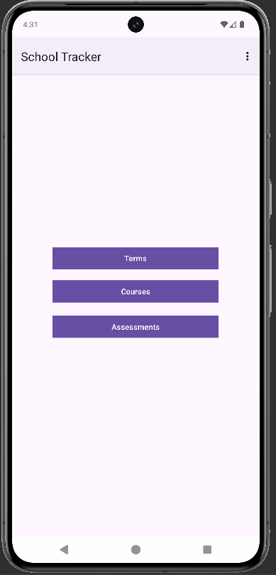
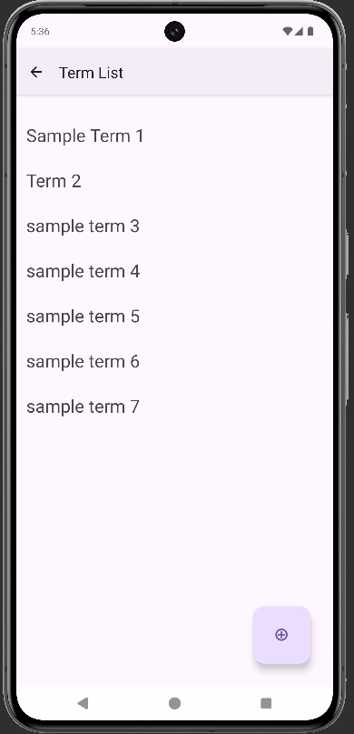
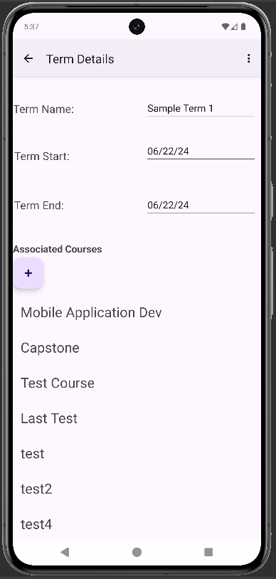
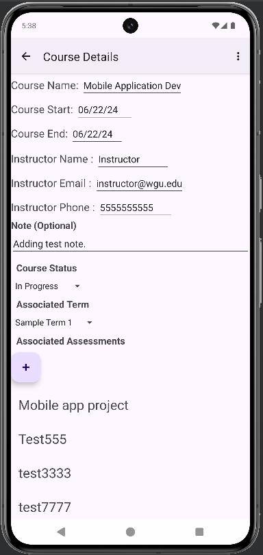
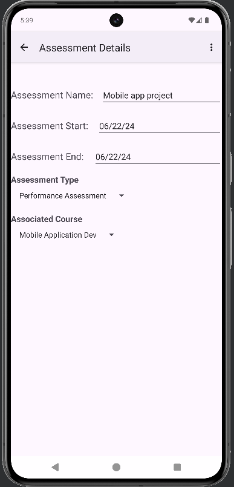
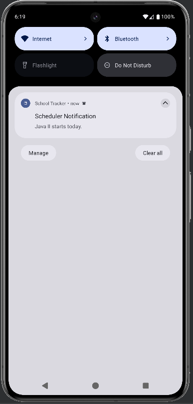

# Student Term Manager

A mobile Android application developed with Java and Room to manage a student's term, course, and assessment data. The user has the ability to create terms, courses, and assessments while associating assessments with courses and courses with terms. 

*Home Screen*

## Features
- Add, edit, and delete terms, courses, and assessments. 
- View courses associated with each term and assessments associated with each course. 
- Add optional notes to individual courses.
- Set start and end date alerts for courses and assessments that can trigger when the application is not running. 
- Share course notes through SMS or email with the message automatically populated. 
- Supports both portrait and landscape orientations across application screens. 

## Screenshots

| Terms | Term Details |
| --- | --- |
|  | 

| Course Details | Associated Assessment |
| --- | --- |
|  | 

| Course Notification |
| --- |
| 

## Technologies 
- Java
- Android
- Room

## Technical Details
### Data Persistence
The application uses Room for local data persistence. Terms, courses, and assessments are stored as related entities, with a term containing multiple courses and a course containing multiple assessments. Each entity has a corresponding DAO used to add, update, delete, and retrieve term, course, and assessment information.

### Notifications
AlarmManager and BroadcastReceiver are used to schedule course and assessment start/end date alerts, allowing notifications to trigger when the application is not running. 

### Screen Orientation
Android XML layouts are used to support portrait and landscape orientations across the application. Separate layouts were created for each orientation, with controls rearranged to accommodate the available screen space.

## Acknowledgements
This project was originally developed as part of my Software Development coursework at Western Governors University.
